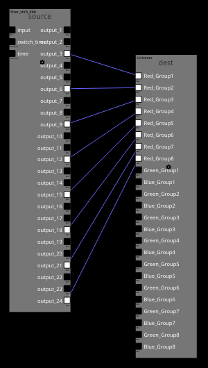

# Connect Command

The connect command can be used to connect multiple filter channels with each other.

## Ussage
Requires a scene to be selected in current CLI context.

```
connect <source channel ID template> <destination channel ID templates> [--guard <smod:X>|<dmod:X>|<dt:DT>|<sfid_contains:STR>|<dfid_contains:STR>|<schan_contains:STR>|<dchan_contains:STR>] [--source-count <count>] [--destination-count <count>]
```

Source channel ID template is a Jinja template (it is recommended to encode it as a string in the command) that must produce a combination of `<filter ID>:<channel name>`.
The same goes for the destination channels, although a list can be provided.
In addition, `--source-count` and `--destination-count` can be used to iterate over channels.
These iterations are zero indexed and can be queried inside the templates with `{{sc}}` and `{{dc}}`.
Furthermore, there is a set of supported filters for the templating available.

 * `add(arg)` adds `arg` to a number
 * `sub(arg)` subtracts `arg` from a number
 * `mul(arg)` multiplies a number with `arg`
 * `div(arg)` divides a number by `arg`

Within iterations, the channel guards can be used to skip connections.
The following checks are available:

 * `smod:<X>` Only allows the connection to be made if the source iteratior modulo `X` yields zero.
 * `dmod:<X>` Only allows the connection to be made if the destination iteratior modulo `X` yields zero.
 * `dt:<DT>` Only allows a connection if the channel data type is of type `DT`. Available data types are:
    - `8bit`
    - `16bit`
    - `float`
    - `color`
 * `sfid_contains:<str>` Only allows a connection if `str` is part of the source filter ID.
 * `dfid_contains:<str>` Only allows a connection if `str` is part of the destination filter ID.
 * `schan_contains:<str>` Only allows a connection if `str` is part of the source channel name.
 * `dchan_contains:<str>` Only allows a connection if `str` is part of the destination channel name.

## Example
The following code snipped connects a shift filter of type `8bit` and ID `source` with an output filter for RGB Led bars called `dest` in scene with ID `0`.
Only the red channels are connected.


```
select scene 0
connect "source:output_{{si|add(1)}}" "dest:Red_Group{{si|div(3)|add(1)}}" --source-count 24
```




## Errata
Using this command might require reopening of filter pages in the editor in order to view the created connections.
