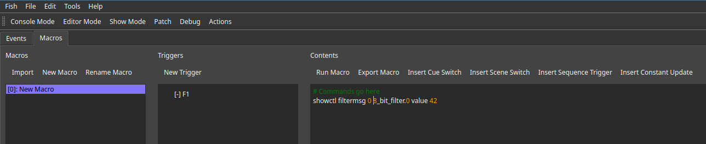

# Creating Macros

Editing can be done in the `Actions` view under Macros.

The left hand side of the editor allows creating macros from scratch or importing existing ones.
Existing macros are listed below and can be renamed by double clicking or selecting them and clicking the rename button.

The right hand side of the editor allows editing of the content of the selected macro.
The insert buttons on top of the text editor open up dialogs to automatically insert commands based on the show file content.

Macros can be executed by clicking the button in the window, by calling `exec <macro id>` from any CLI contenxt or by assigning a trigger to them.
A common use case are macro buttons from the show UI.
Existing triggers associated with the current macro are listed below the `Add Trigger` button.
The following trigger conditions are available at time of writing:
 * `startup`: These macros are executed as soon as the showfile gets loaded
 * `showfile_applied`: These macros are executed every time the show file gets successfully applied to fish.
 * `f_keys`: These macros are executed once the user clicks the `F` keys on the control desk.

While macros can call other macros, recursion is not supported and will raise an error.

