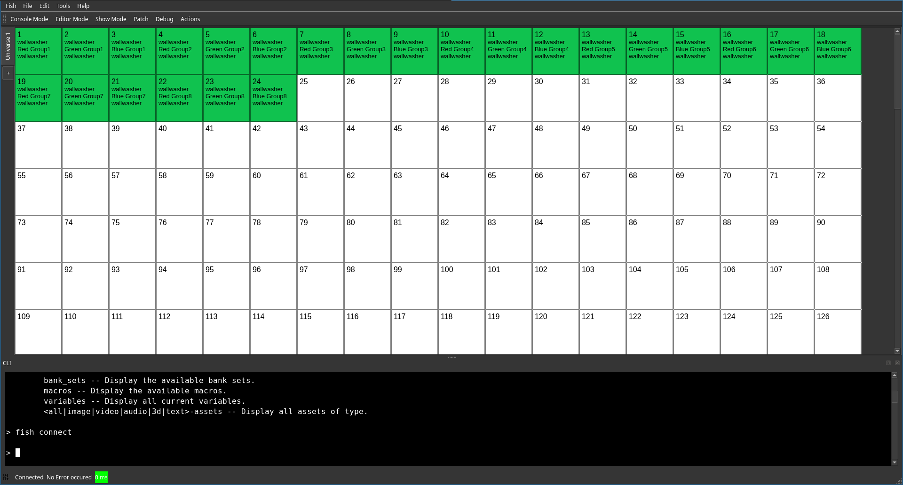

# Command Line Interface

The command line interface is available as:
 * Macros and embedded commands
 * An embedded terminal in the GUI
 * If enabled, through a telnet port open on port `2929`.

## accessing CLI using the GUI

By pressing `CTRL+T`, or by using the menu bar action under `Tools`, the GUI terminal can be toggled on or off.
By default it is displayed at the bottom of the main window but can be moved around the edges of the window or detached entirely.

*Known Limitations* After toggling the terminal, the scroll bar jumps to the bottom of the terminal and the user needs to scroll to the cursor position manually.

## Remote Access

The remote access port can be enabled or disabled in the settings.
Once enabled, it provides the same access to the CLI as a local user and no authentication is required through TCP port `2929`.
Therefore, this feature should be used with caution and only in air gapped networks or with carefully crafted firewall rules.
However, this behavior is required to integrate with other production equipment, which usually does not know the concept of computer security.

## Advanced features

While the used command language isn't as feature-rich as a modern shell, it provides some advanced features.
 * Comments are started by `#`
 * The set instruction can be used to set variables. If one for example issues ´set var foo´, the value `foo` can be retrieved at a later stage by writing `$var`.
 * Basic control flow can be managed using `if`. The syntax looks as follows: `if <Expression> then <command>`. Expressions are build using `<value A> <comparison> <value B>`. While values can be anything, supported comparisons are `<`, `>`, `=`, `!=`, `and` and `or`.

## Command Documentation
In general you can type `help <command or topic>` to get a brief introduction.
However, here is a list of special documentation for selected commands:
 * [`connect`](Connect-Command.md)
 * [`event`](Event-Command.md)
 * [`list`](List-Command.md)

