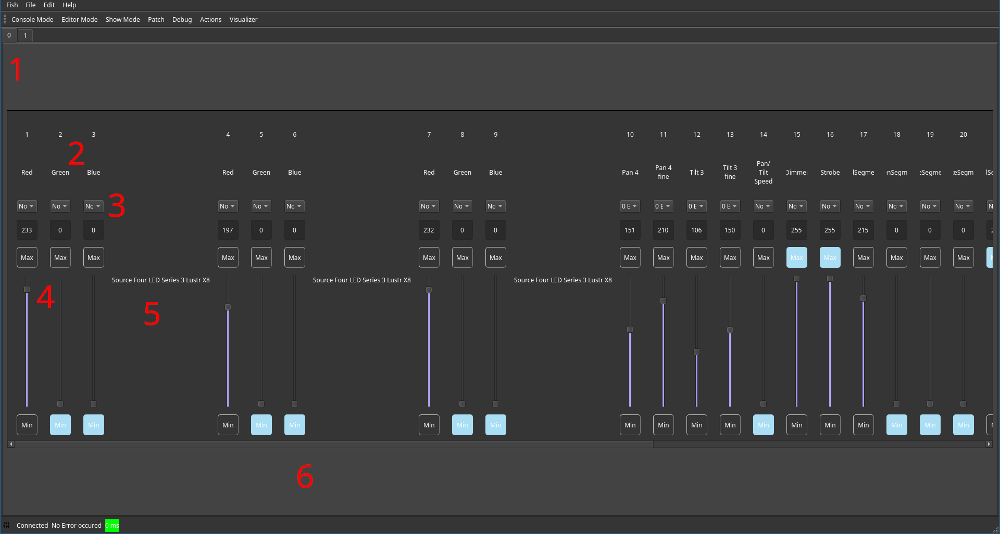

---
---
# Console View

The quick console view can be reached by pressing *Console Mode* button in the navigation bar or by pressing *Console* on the XTouch. Once you patched in some fixtures, this view allows you to set their channels manually. This is helpful if you like to quickly enable some light on the stage or debug / test your setup.

In the top, a tab appears for every universe (1). Clicking on them switches between the controlled universe. Within a universe, all patched channels (2), grouped by their fixture (5) are available.
The scroll bar (6) can also be controlled using the jog wheel of the XTouch.

A channel can be controlled using the virtual fader (4) or, using the text box above, a precise value can be entered. The *Min* and *Max* buttons set the channel value to `0` or `255` immediately. Using the bank set mapping selection (3) a channel can be controlled from the XTouch, any changes done inside the GUI or hardware being synchronized automatically.

<!-- TODO explain scene defaults and automapping -->
