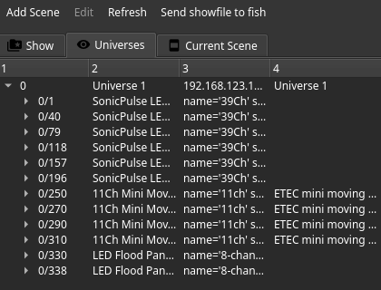
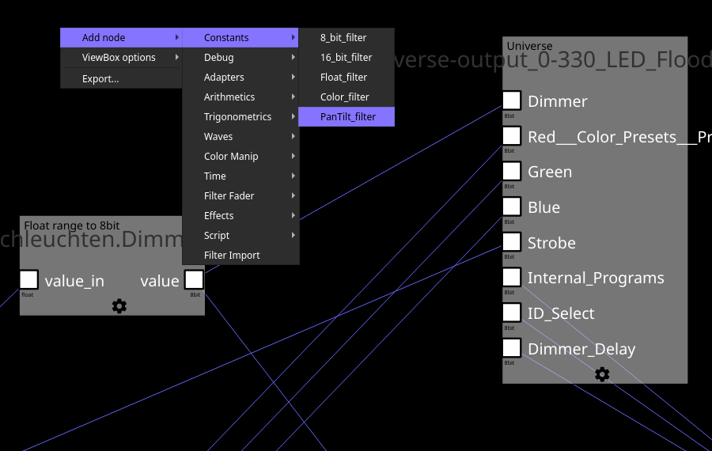
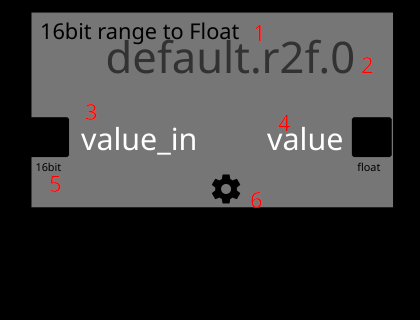

# Editor View

The editor consists out of four primary widgets.

1. An action bar giving access to
    * Adding new scenes
    * Editing the current selected item
    * Refreshing the show browser
    * Applying the current show file state to fish
2. The show browser
3. A tab view allowing to switch between current open editors
4. A currently displayed editor page

## Show browser

The show browser allows you to navigate the content of the show file.
It provides gloabal show content (`Show`), access to fixtures, sorted by universes (`Universes`) and content of the current scene (`Current Scene`).

### Global Structure

The show file is structured by global items, such as scenes, macros, event mapping and media objects.
Within global objects a hirachy exists.
Most notably, scenes are structured by their contained filter pages, UI pages as well as their fader banks.

Right clicking any items opens up a context menu providing appropriate options. Nesting filter pages is possible.

Usage of each element is described below.

### Universes

The universe view displays all universes, their fixtures and channels. Furthermore it displays associated information and allows automatic placement of
filters to use a fixture in the current open filter page by double clicking it.

### Scene view

THe scene view displays content and additional information of the current scene.

## Editors

There a multiple different editors, opened depending on the content.

### Filter Page Editor

Filters within a scene are associated with a filter page. They can be multiple ones, each named differently, in order to structure them. Nesting of filter pages is possible as well.
As filters from all filter pages of the scene are consolidated and executed together, their names need to be unique. Under normal circumstances, the editor takes care of this by
appending an increasing counter on filters in case of duplicated IDs. However, as it is possible to force overlapping IDs (if you don't know why this is the case, you don't need
it and shouldn't do this) using the command line, the user needs to be aware of this. Duplicate Filter IDs will break show file loading on fish and will result in broken show
files after save and reload.

In order to place a filter inside a page it can be added using the context menu of the cursor, command line or various automatic means.

A filter is displayed below. It contains out of its type (1), name (2), zero or more input channels (3), zero or more output channels (4) and a button to open the configuration widget (6).
This button is only displayed if the filter has options to configure. Each channel also displays its supported data type (5). Channels of matching data types can be connected using drag and drop.
Each input channel that does not feature a default value needs to be connected to an output channel in order for fish to load a show. One output channel can be connected to multiple input channels.
Filters located in other filter pages of the same scene can be imported using the `Import Filter` action. If a filter from a different page is displayed without such an import filter, it is
rendered as a "ghost" filter within the current one.

The names of filters can be changed by double clinking on the name tag followed by input of the new name. Filters can be dragged around to position them.
Links between filters can be removed by selecting them and pressing the delete button.

### UI Editor

### Fader Editor

### Media Management Editor

### Scene Default editor
A scene has default values for the universe that are applied upon switching to the scene.
This editor allows you to set them.
Basically, this is editor page behaves like the quick console mode, except that it does not allow you to map channels to faders in order to prevent accidents and confusion.
