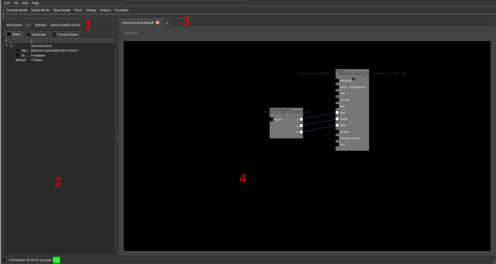
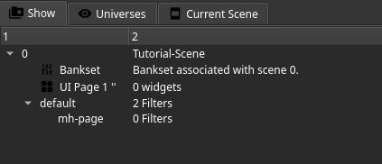
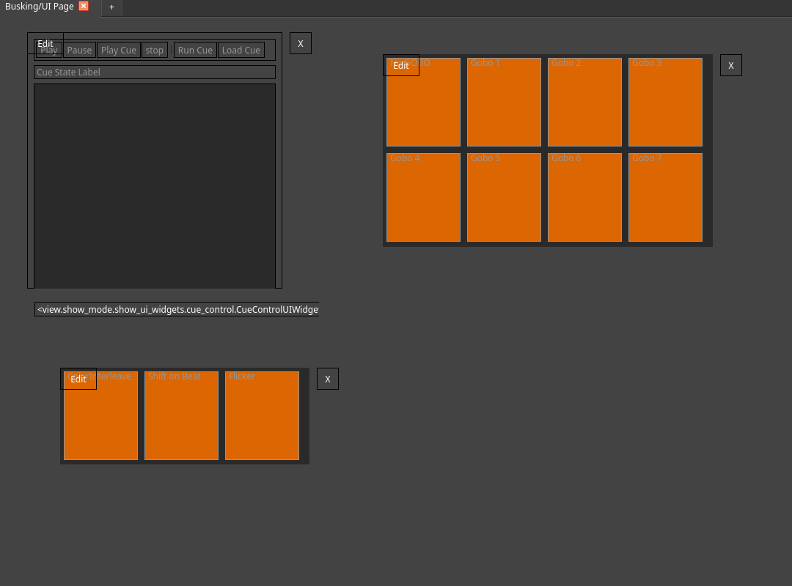
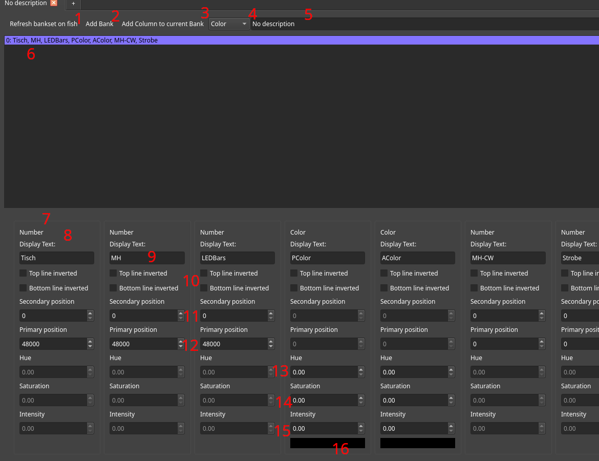

---
---
# Editor View

The editor consists out of four primary widgets.

1. An action bar giving access to
    * Adding new scenes
    * Editing the current selected item
    * Refreshing the show browser
    * Applying the current show file state to fish
2. The show browser
3. A tab view allowing to switch between current open editors
4. A currently displayed editor page

## Show browser

The show browser allows you to navigate the content of the show file.
It provides gloabal show content (`Show`), access to fixtures, sorted by universes (`Universes`) and content of the current scene (`Current Scene`).

### Global Structure

The show file is structured by global items, such as scenes, macros, event mapping and media objects.
Within global objects a hirachy exists.
Most notably, scenes are structured by their contained filter pages, UI pages as well as their fader banks.

Right clicking any items opens up a context menu providing appropriate options. Nesting filter pages is possible.

Usage of each element is described below.

### Universes

The universe view displays all universes, their fixtures and channels. Furthermore it displays associated information and allows automatic placement of
filters to use a fixture in the current open filter page by double clicking it.

### Scene view

The scene view displays content and additional information of the current scene.

## Editors

There a multiple different editors, opened depending on the content.

### Filter Page Editor

Filters within a scene are associated with a filter page. They can be multiple ones, each named differently, in order to structure them. Nesting of filter pages is possible as well.
As filters from all filter pages of the scene are consolidated and executed together, their names need to be unique. Under normal circumstances, the editor takes care of this by
appending an increasing counter on filters in case of duplicated IDs. However, as it is possible to force overlapping IDs (if you don't know why this is the case, you don't need
it and shouldn't do this) using the command line, the user needs to be aware of this. Duplicate Filter IDs will break show file loading on fish and will result in broken show
files after save and reload.

In order to place a filter inside a page it can be added using the context menu of the cursor, command line or various automatic means.

A filter is displayed below. It contains out of its type (1), name (2), zero or more input channels (3), zero or more output channels (4) and a button to open the configuration widget (6).
This button is only displayed if the filter has options to configure. Each channel also displays its supported data type (5). Channels of matching data types can be connected using drag and drop.
Each input channel that does not feature a default value needs to be connected to an output channel in order for fish to load a show. One output channel can be connected to multiple input channels.
Filters located in other filter pages of the same scene can be imported using the `Import Filter` action. If a filter from a different page is displayed without such an import filter, it is
rendered as a "ghost" filter within the current one.

The names of filters can be changed by double clinking on the name tag followed by input of the new name. Filters can be dragged around to position them.
Links between filters can be removed by selecting them and pressing the delete button.

### UI Editor

The UI editor allows configuration of the show UI pages of the scene. Widgets can be added using the context menu of the cursor or using the command line.
A widget can be dragged to position it and provides an edit button to configure it. Usually a widget allows editing of its size as well as other properties.
if a widget needs to be linked to certain filters for operation, they need to be selected upon creation.

As time of this writing, the following widgets can be used:

 * _Auto Tracker_ A widget to control the auto tracker virtual filter. It allows selecting the persons to be tracked on stage.
 * _Button Array_ An array of buttons that displays configured buttons. Clicking a button allows updating a constant based on the configured content.
 * _Button Array with Submit_ Basically, this provides the same functionality as the one above. However it only applys the selected values once the user issues submit or the commit action from an attached X-Touch.
 * _Color Picker_ Provides a color picker to input colors for various use cases.
 * _Cue Control_ Provides a widget to control a cue filter.
 * _Sequence Listing_ Provides a widget to inspect and control a sequencer filter.
 * _Pan/Tilt Control_ Provides a widget to override pan tilt settings of an associated filter.
 * _Text Label_ Displays the configured text.
 * _BF Clock_ Displays the current time.
 * _Macro Buttons_ Allow macros or individual commands to be run when the user clicks on them. They are optimized for touch screens and allow displaying of icons.
 * _Color Visualizer_ Display the color that gets input into color debug filters.
 * _Number Output_ Display the values fed into number based debug filters.

### Fader Editor

If one wishes to use the Faders of the X-TOuch within a scene as input, one needs to instantiate corresponding input filters as well as configuring the bank set itself.
The latter is done using this view.
First, a new bank needs to be added to the set using button (2). Existing banks and their columns are listed in the view below (6).
A column of the specified type (4) can be added using the `Add Column to Bank` button (3).
The description of the bank set (which is useful for human reference) can be edited using the text box to the right (5).

Columns are listed and available for editing in the bottom view (7).
Each column has a header displaying its type (8) and allows editing of the text displayed on the X-Touch (9).
In order to identify important columns quickly during the show, the display style of the columns can be inverted (10).

If a column is of type number, using the corresponding text boxes, the primary (11) and secondary (12) values can be entered.
During a show, pressing the rotary encoder button of the column changes between editing of secondary and primary values.
The rotary encoder can be used to make fine adjustments to the current value.
A number column represents a 16 bit value.

If a column is of type color, defaults for hue (13), saturation (14) and intensity (15) of the column can be entered.
Below, there is a preview of the default color (16).

Finally, if changes are made to the bank set, they need to be applied using the corresponding button (1).

### Media Management Editor

TODO

### Scene Default editor
A scene has default DMX values for the universe that are applied upon switching to the scene.
They can be edited using this editor page, simmilar to the live console.

This editor allows you to set them.
Basically, this is editor page behaves like the quick console mode, except that it does not allow you to map channels to faders in order to prevent accidents and confusion.
