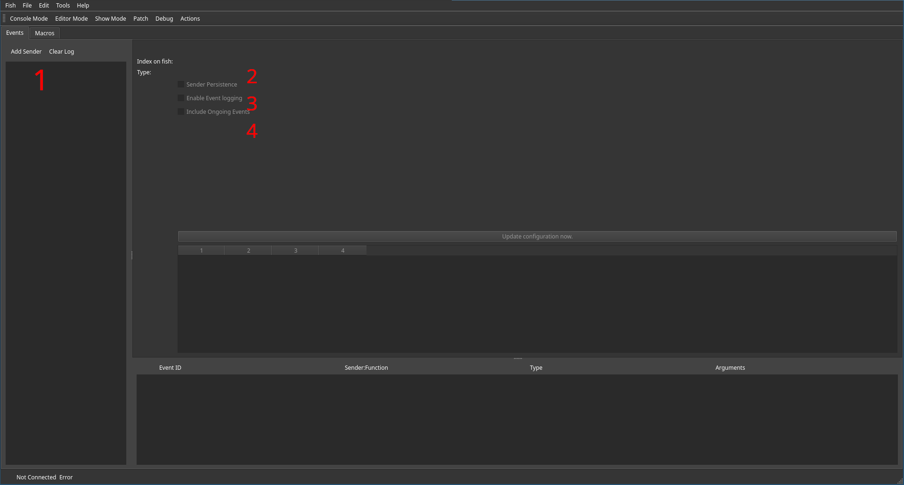
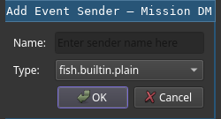

# Events

The event routing is accessable through the `Actions` View.

TODO explain plain event senders as reference for commands and Lua scripts.

Event senders are used to reference Events. Most of them also possess the capability to insert events on their own.
Events itself can either be:

 * A single occurance (For example a drum kick)
 * Begin of a longer event (for example a button press)
 * In the middle of a longer event
 * Or the end of a longer event

Furthermore, each event is classified by its sender and function within. For example a GPIO event sender provides different functions based on the port.
This can be used to sieve events using the CLI or within a filter.
Depending on the event, some of them also carry further arguments to provide additional data.

Event senders can be added using the `Add Sender` button (1).
For any given event sender, at least its persistence (2), and logging enablement (3) can be configured.
In case continious events of that should also be logged, the checkbox below (4) can be activated.

## Adding Event Senders

After clicking the `Add Sender` button, a dialog asking for a name and type of event sender pops up.
It is advisable to give a unique and descriptive name, as event senders can either be queried using their
(automatically assigned) ID or their name.

Non-trivial types of event senders are explained below.

## Event Sender Types

### GPIO Event sender
TODO explain X-Touch GPIO event sender

### Audio Extractor
TODO explain beat detector, using screenshot

### MiDi Event sender
TODO explain MIDI event sender

### Macro Keypad
TODO explain events from macro keypads
