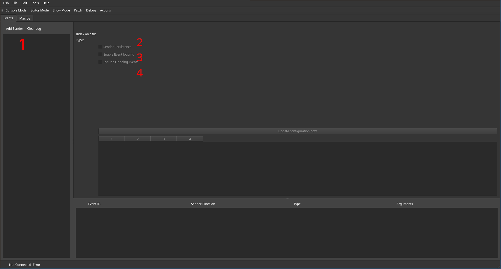
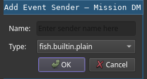
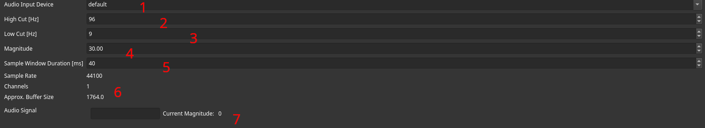

# Events

The event routing is accessable through the `Actions` View.

TODO explain plain event senders as reference for commands and Lua scripts.

Event senders are used to reference Events. Most of them also possess the capability to insert events on their own.
Events itself can either be:

 * A single occurance (For example a drum kick)
 * Begin of a longer event (for example a button press)
 * In the middle of a longer event
 * Or the end of a longer event

Furthermore, each event is classified by its sender and function within. For example a GPIO event sender provides different functions based on the port.
This can be used to sieve events using the CLI or within a filter.
Depending on the event, some of them also carry further arguments to provide additional data.

Event senders can be added using the `Add Sender` button (1).
For any given event sender, at least its persistence (2), and logging enablement (3) can be configured.
In case continious events of that should also be logged, the checkbox below (4) can be activated.

## Adding Event Senders

After clicking the `Add Sender` button, a dialog asking for a name and type of event sender pops up.
It is advisable to give a unique and descriptive name, as event senders can either be queried using their
(automatically assigned) ID or their name.

Non-trivial types of event senders are explained below.

## Event Sender Types

Besides generic purpose event senders (`fish.builtin.plain`) the following specialized event senders are available.

### GPIO Event sender
Connexted XTouch controllers provide GPIO ports on their back.
If foot pedals (or simmilar) are connected to these ports, the generated events are inserted using this type of event sender.

The port number causing the event is encoded as the function of the event.
Based on the connected port, the event type will either be a single trigger or start and release events.
In case of analog values, the first argument date is set to the value.

### Audio Extractor

Audio Extraction Event Sources connect to the specified sound input and perform an FFT based beat analysis on the input.
For every detected beat, an event (with function set to `0`) is issued.

Configuration is done in the following manner:
1. Selection of the audio source. This drop down list all audio sources available at startup. If required, the entered source ID can be manually edited.
2. High cutoff frequency. Any audio input above this threshold frequency will not be regarded as containing beat information. Dialing this in, is important to not accidentally sync to the wrong parts of input music.
3. Low cutoff frequency. Likewise any data below this value will not be considered. This can be used to prevent changes in static signals from triggering events.
4. Triggering signal magnitude. If the avarage input volume is below this value within the current window, the input will be discarded as silent static noise. Use the current input meter (`7`) to find correct settings.
5. Window duration. How long should the detection window be? Smaller durations risk missing beats in slower music while longer durations increase latency which effects the speed at which changes to the input are recognized. The default (40ms) seams to be a good sweet spot for most live concerts.
6. Based on the above settings, the window parameters are calculated and put up for preview. If, for some reason, the audio source cannot be connected or resampling fails, use this information, together with onboard ALSA tools, for debugging.
7. If the current configured audio extraction event source receives input, its amplitude is previewed here.

The cutoff frequency defaults are save values for most applications. Only change them if they do not work for you.

Changes to these settings only take effect, once the apply button was hit.

### Lua Event Sender

Any lua script that uses events, will be assigned an event sender automatically.
The filter id of the script is used as the name of the sender.
This is the default event sender of the script.

### MiDi Event sender
TODO explain MIDI event sender

### Macro Keypad
TODO explain events from macro keypads
