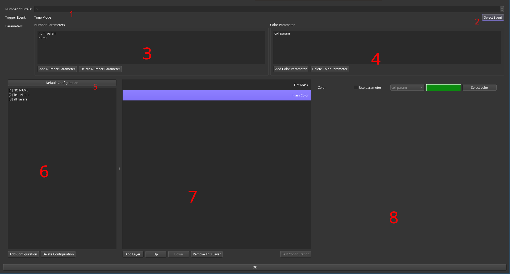
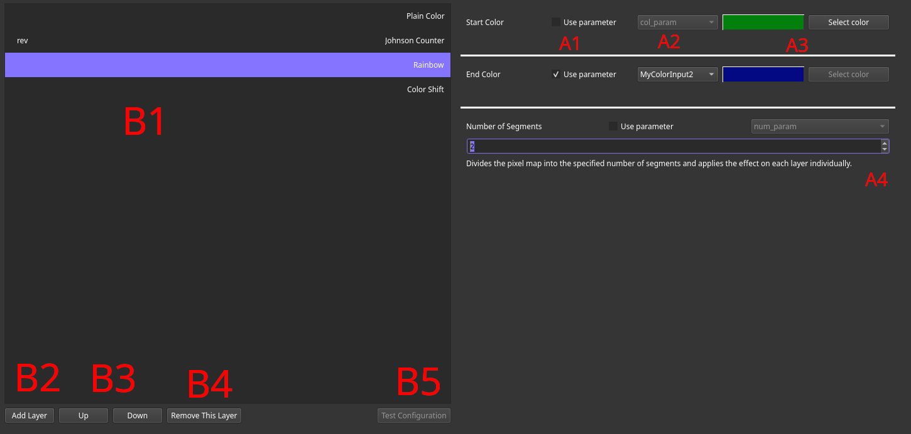
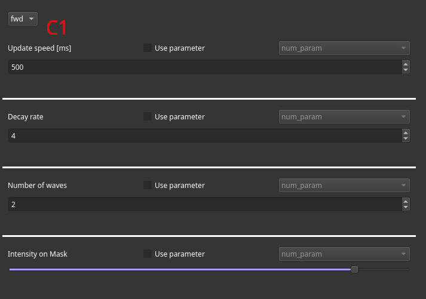
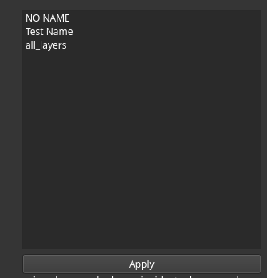
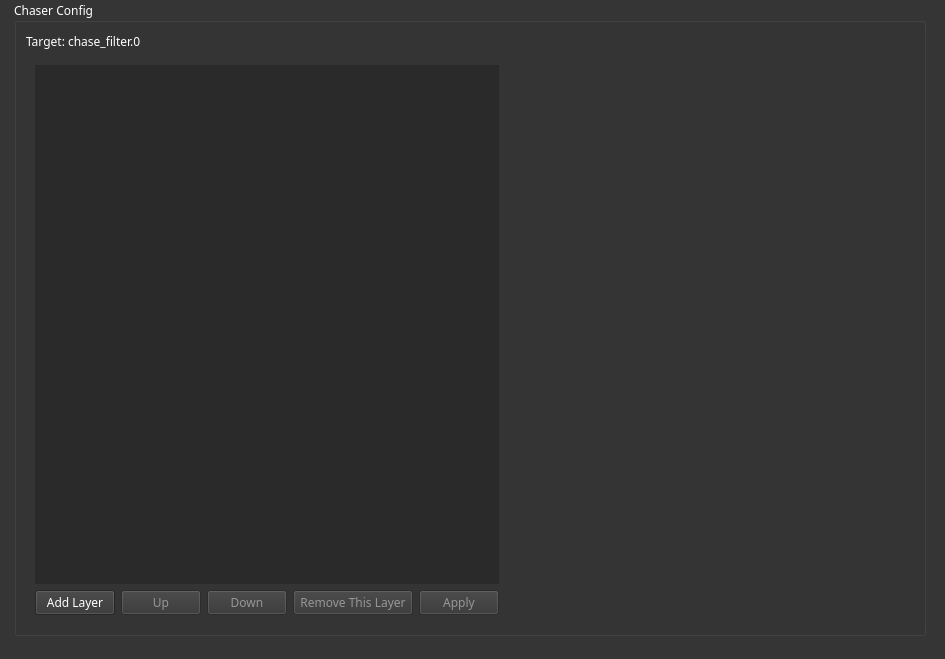

# Using the Chaser Filter

The chaser filter generates effects for a defined number of output color channels by applying selected layers after each other on the color data using an intensity mask.
For each output pixel, a numbered output channel is created, starting at `0`.
Updates to effects can either be synchronized to time (in which case the time and time scaling inputs are used) or to events.
Layers can be set up using static color or number parameters or the parameters values can be gathered from corresponding input channels.

## General Setup

Based on the selected preview mode, either the parameter settings (`3`, `4`) or the `Test Configuration` (`B5`)) button are available.
If no parameters are defined yet, preview mode will always be disabled.

The pixel count can be dialed in with `1`.
Underneath this control, the current selected event or `Time Mode` is displayed.
If no event is selected, the chaser will be updated on the configured time intervals.
Using the event selection button (`2`) the updating event can be set or cleared.
It is advisable to define and rename events beforehand as selection based on human readable events is easier.

The number and color parameter inputs are listed in `3` and `4` respectively.
Current channels are listed there and can be added or removed with the buttons below.
In order to remove a parameter, it must be selected prior to pressing the remove button.
As these parameters are mapped to channels, names must be unique and must not contain special characters.
Once the settings dialog is closed, the filter channels will be updated.

Each chaser filter has a default configuration that will be loaded initially.
It can be accessed for editing using the corresponding entry (`5`).
Additional presets can be managed using the preset list (`6`) and the corresponding addition and removal buttons below.

## Adding and Configuring Layers

Each configuration consists out of layers.
Each layer in the current configuration is listed on the right (`B1`).
Selecting a layer enables its editing on the left hand side, moving it up or down the stack (`B3`) or removing it (`B4`).
New layers can be added to the bottom of the stack by pressing the `Add Layer` button (`B2`), which will bring up a corresponding dialog.

Each layer can be configured on the left hand side.
For each setting the user chan choose between external input or using a constant by toggling the `use parameter` checkbox (`A1`).
If this checkbox is enabled, a orresponding number or color parameter input can be selected using the selection bar on the left (`A2`).

If a constant is desired, a color (`A3`) or number (`A4`) can be dialed in.
Numbers can either be exact (for exampe the number of segments for a specific layer) or relative.

Some layers provide multiple possible behaviors.
If such a layer is selected, the desired settings can be entered on top of the parameter view (`C1`).

Pressing the test button (`B5`) sends the current selected configuration to fish.

## UI Widget

There are two UI widgets usable with chaser filters, listed beloq.

### Preset Application Widget

The `Chaser Preset Selector` widget lists up all configured presets.
A selected one can be applied using the Apply button.

### Live Configuration Widget

The `Chaser Live Config Tool` provides the ability to build up configurations directly in the show UI.
Usage is identical to the configuration editor within the filter settings panel.
Clicking the `Apply` button uploads the current configuration to the associated filter (or waits for the next readymode commit).

