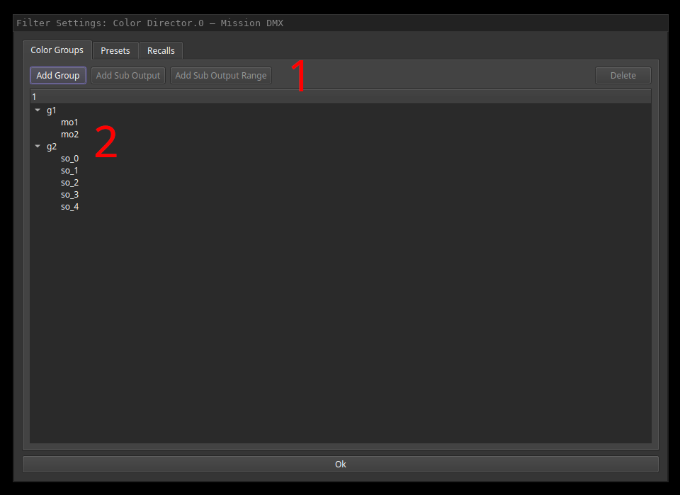
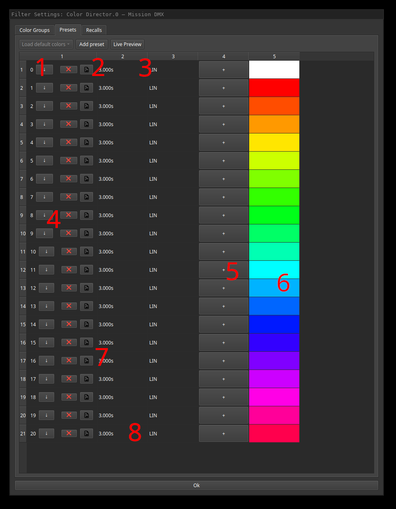
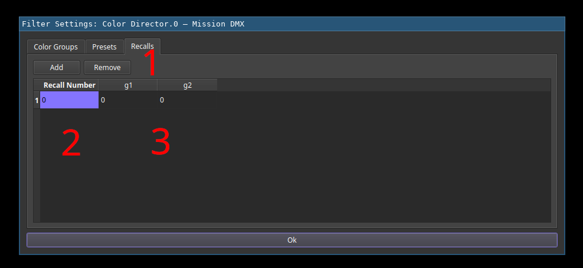

# Color Director Filter

A color director applies a color palette on definied output groups.

## Configuration

First add output groups (1). Each group can have multiple outputs that will get the color presets applied in al alternating fashion.
Single output or ranges of outputs can be added using the provided buttons. Existing groups are listed below (2). In order to add outputs,
the target group needs to be selected first. Selected groups or outputs can be deleted using the button in the top right.

The presets tab can be used to configure the color palette.
If there are no presets defined, various default pallets can be loaded using button (1).
Using button (2) further color presets can be added to the set.
In addition to a dialog appearing while starting the configuration, live preview can be toggled using button (3).

Each preset consists out of one or more steps. They can be added or removed using buttons (4).
Each step has a fade-in time and transfer function that can be configured (8).
The colors within the step can be edited by clicking on them (field 6; in live preview, a fader will appear for editing) and further colors can be added using the plus button (5).
The colors in each step are evenly distributed across the outputs in the selected group.

Finally, for each preset, a representative icon can be selected from the asset list using the image button (7).

Inside the recalls tab, recalls can be added or removed using the top buttons (1).
Each recall has a number (2) that can be entered in the show UI widget to automatically load the colors for each output group that are defined in the table (3).
In the above example, all output groups would switch to the first configured preset (here white) if the user would load recall 0.

## Usage in Show UI

The color director show UI widget can be used to select a preset for each output group as well as loading recalls.
