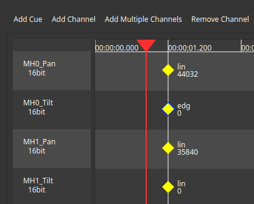
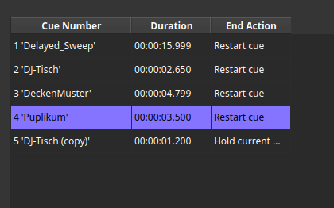

# Cue Filter

Cue filters allow you to record changes to a range of predefined channels marked at a given time (called *cue*).
Using control widgets in the show UI or CLI commands, the current running cue can be changed, paused, stopped or restarted.
Based on user setting for a given cue, the current values are hold, the cue gets restarted or the next cue is played once the cue finished.

Typical use cases of cue filters are building theatre cues using one large configuration or having multiple filters controlling small features that can be used to compose complex behaviors while busking.

## Editing Cues

If you open the settings of a cue editor you'll be greeted with a dialog asking you if you'd like to switch to preview mode or would like to stay at the current show configuration.

If you say no here, the current running show will continue without interruption.
If you say yes, the show file will be reapplied with the cue filter accepting the current entered channel data as live preview.
The latter is quite helpful while building show files.

At any given time only one cue filter (or sequencer filter for that matter) should be in live preview mode.
If a filter was in live preview mode and its settings panel gets closed, it will be reverted to normal configuration.

### Channel Management

The first thing that should be done with a fresh cue filter is adding channels.

Channels can be added using the `Add Channel` or `Add multiple Channels` buttons.
The first one only asks for a channel name and data type for a single channel. The second one opens up a dialog allowing the user to automatically add a range of channels.

This allows the user to specify a naming template and channels to be created with this template. Finally, the user has to specify the number of sets to create.
In the above example, a total of 8 channels with `16bit` data type are going to be created. Their names range from `MH1_Pan` to `MH4_Tilt`.

Each added channel is listed in the timeline editor below.
Channels that have been accidentally generated (or aren't required anymore) can be removed using the `Remove Channel` button.
In this case, a dialog opens up and allows selection of the channels to be removed.

Once channels have been added, the settings panel should be closed and the new output channels of the filter should be connected to their destinations.
Once this is done, the settings can be reopened and the cues can be programmed (preferrably in live preview mode).

### Cue Management

New Cues can be added using the `Add Cue` button. Pressing it will add a new cue with empty title to the cue list.

This list provides the name of the cue, its length as well as its end action. This way one can see the flow of cues with a single look.

The name of a cue can be altered by right clicking its entry, followed by the selection of `Rename Cue`.
Besides renaming, the context menu also allows moving the cue around, duplicating it as well as deletion.

### Using the Timeline Editor

The timeline editor consists out of the channel list and the keyframes that are layed out through their time slots.
The cursor can be moved by clicking on the time code bar at the top or by turning the control desk jog wheel. The seven segment displays on the control desk display the current time code as well.

By clicking the plus and minus buttons, or by holding the zoom button while simultaneusly turning the jog wheel, the time frame (i.e. zoom level) can be changed.

If the user clicks the record button on the control desk (if in live preview mode) or inside the GUI, a set of key frames are inserted at the current location with the selected transition types and currently dialed in values.
Clicking a key frame will load the settings of the set into the current live preview if the mode was chosen. Clicking them a second time opens up a dialog which allows the user to change the settings of the selected frame.

TODO include image with multiple channels of different data types.

### Settings panel

TODO describe general settings and cue settings panel

## Control UI Widget

TODO describe show UI widget usage
