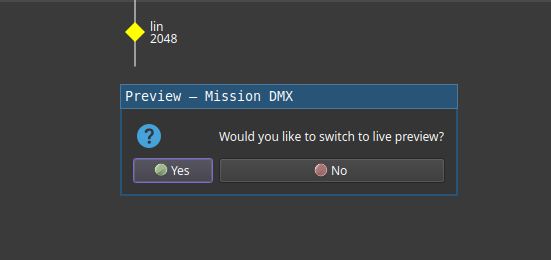
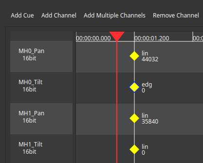
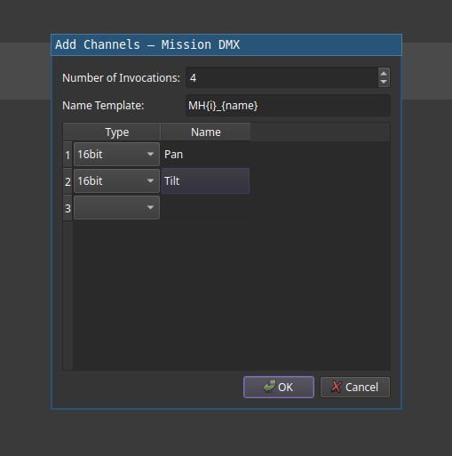
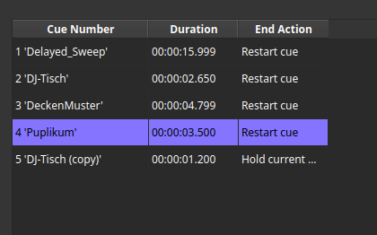
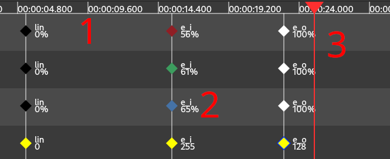
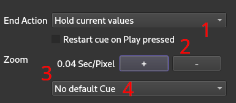
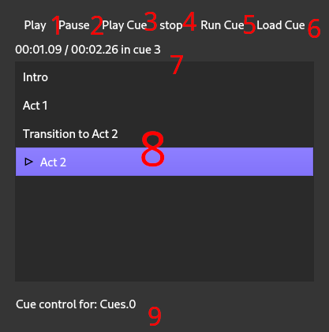

# Cue Filter

Cue filters allow you to record changes to a range of predefined channels marked at a given time (called *cue*).
Using control widgets in the show UI or CLI commands, the current running cue can be changed, paused, stopped or restarted.
Based on user setting for a given cue, the current values are hold, the cue gets restarted or the next cue is played once the cue finished.

Typical use cases of cue filters are building theatre cues using one large configuration or having multiple filters controlling small features that can be used to compose complex behaviors while busking.

## Editing Cues

If you open the settings of a cue editor you'll be greeted with a dialog asking you if you'd like to switch to preview mode or would like to stay at the current show configuration.

If you say no here, the current running show will continue without interruption.
If you say yes, the show file will be reapplied with the cue filter accepting the current entered channel data as live preview.
The latter is quite helpful while building show files.

At any given time only one cue filter (or sequencer filter for that matter) should be in live preview mode.
If a filter was in live preview mode and its settings panel gets closed, it will be reverted to normal configuration.

### Channel Management

The first thing that should be done with a fresh cue filter is adding channels.

Channels can be added using the `Add Channel` or `Add multiple Channels` buttons.
The first one only asks for a channel name and data type for a single channel. The second one opens up a dialog allowing the user to automatically add a range of channels.

This allows the user to specify a naming template and channels to be created with this template. Finally, the user has to specify the number of sets to create.
In the above example, a total of 8 channels with `16bit` data type are going to be created. Their names range from `MH1_Pan` to `MH4_Tilt`.

Each added channel is listed in the timeline editor below.
Channels that have been accidentally generated (or aren't required anymore) can be removed using the `Remove Channel` button.
In this case, a dialog opens up and allows selection of the channels to be removed.

Once channels have been added, the settings panel should be closed and the new output channels of the filter should be connected to their destinations.
Once this is done, the settings can be reopened and the cues can be programmed (preferrably in live preview mode).

### Cue Management

New Cues can be added using the `Add Cue` button. Pressing it will add a new cue with empty title to the cue list.

This list provides the name of the cue, its length as well as its end action. This way one can see the flow of cues with a single look.

The name of a cue can be altered by right clicking its entry, followed by the selection of `Rename Cue`.
Besides renaming, the context menu also allows moving the cue around, duplicating it as well as deletion.

### Using the Timeline Editor

The timeline editor consists out of the channel list and the keyframes (2) that are layed out through their time slots.
The cursor (3) can be moved by clicking on the time code bar (1) at the top or by turning the control desk jog wheel. The seven segment displays on the control desk display the current time code as well.

By clicking the plus and minus buttons, or by holding the zoom button while simultaneously turning the jog wheel, the time frame (i.e. zoom level) can be changed.

If the user clicks the record button on the control desk (if in live preview mode) or inside the GUI, a set of key frames are inserted at the current location with the selected transition types and currently dialed in values.
Clicking a key frame will load the settings of the set into the current live preview if the mode was chosen. Clicking them a second time opens up a dialog which allows the user to change the settings of the selected frame.

The following transition types are available:

<table style="padding: 10px;">
  <thead>
    <tr>
      <th style="padding: 5px;border-bottom: 1px solid;border-right: 1px solid;">Key</th>
      <th style="padding: 5px;border-bottom: 1px solid;border-right: 1px solid;">Curve</th>
      <th style="padding: 5px;border-bottom: 1px solid;">Description</th>
    </tr>
  </thead>
  <tbody>
    <tr>
      <td style="padding: 5px;border-bottom: 1px solid;border-right: 1px solid;">lin</td>
      <td style="padding: 5px;border-bottom: 1px solid;border-right: 1px solid;"></td>
      <td style="padding: 5px;border-bottom: 1px solid;">Linear Transition from last key frame to current</td>
    </tr>
    <tr>
      <td style="padding: 5px;border-bottom: 1px solid;border-right: 1px solid;">edg</td>
      <td style="padding: 5px;border-bottom: 1px solid;border-right: 1px solid;"></td>
      <td style="padding: 5px;border-bottom: 1px solid;">The transition to the current value occurs instantly</td>
    </tr>
    <tr>
      <td style="padding: 5px;border-bottom: 1px solid;border-right: 1px solid;">sig</td>
      <td style="padding: 5px;border-bottom: 1px solid;border-right: 1px solid;"></td>
      <td style="padding: 5px;border-bottom: 1px solid;">The transition from the last frame to the current follows a sigmoidal curve.</td>
    </tr>
    <tr>
      <td style="padding: 5px;border-bottom: 1px solid;border-right: 1px solid;">e_i</td>
      <td style="padding: 5px;border-bottom: 1px solid;border-right: 1px solid;"></td>
      <td style="padding: 5px;border-bottom: 1px solid;">Transition starts slowly with increasing speed</td>
    </tr>
    <tr>
      <td style="padding: 5px;border-right: 1px solid;">e_o</td>
      <td style="padding: 5px;border-right: 1px solid;"></td>
      <td style="padding: 5px;">Transition starts fast with decreasing speed</td>
    </tr>
  </tbody>
</table>

### Settings panel

The general settings panel provides settings modifying the behavior of the entire cue filter as well as the current selected cue.
It consists out of
 * A section widget to select the end action of the current selected cue (1)
 * A check box to enable restarting the current active cue on received play command (2)
 * A zoom indicator (3) and buttons to zoom without requiring a connected controller
 * A selector for a default cue that will be started on filter loading
 * (If applicable) a checkbox to enable inter scene state persistence

The following end actions are available:
 * Hold current Values: If the cue reaches its end, execution is paused and all values are maintained. Use this setting to build transitions into static configurations.
 * Restart Cue: If the cue reaches its end, the same cue will be scheduled again. Use this setting to build repeating effects.
 * Jump to next cue: At the end of the current cue, the next cue from the stack will be scheduled.

## Control UI Widget

In order to control a cue filter from the show UI, a special widget, called `Cue Control`, exist.

The following functionality is provided:
 * Resume Playback of current active cue (1)
 * Pause Playback of current active cue (2)
 * Restart Playback of current active cue (3)
 * Stop Playback of current active cue (4)
 * Load selected cue and begin playback immediately (5)
 * Load selected cue and begin playback once the current active cue reached its end (6)

The time code label (7) displays the current cursor position in the current active cue as well as it length.
The current active cue is also displayed by a play or pause icon (depending on state) in the cue stack display (8).
Besides listing of cues, they can also be selected for loading.
Finally each cue control displays the connected cue filter (9).

