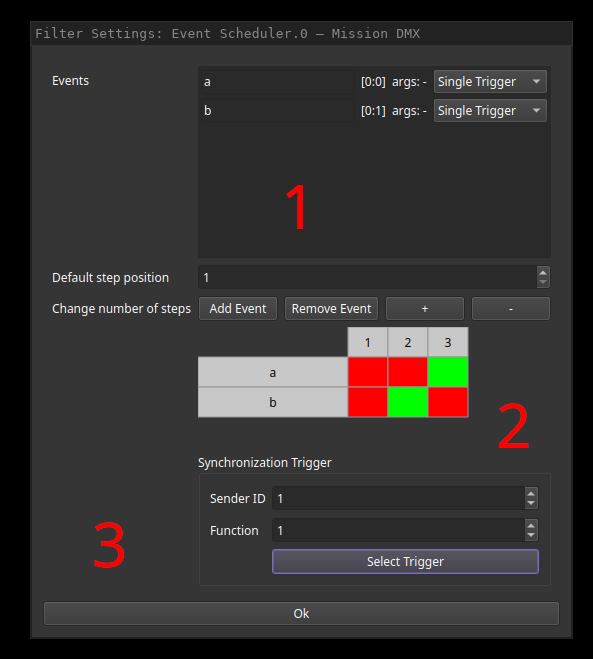

# Event Scheduler Filter

The event scheduler is capable of triggering configured output events upon arrival at a configured step.
Steps can be advanced through incomming trigger events or UI commands.
Think of a midi sequencer but for show events.

## Configuration

Output events can be configured within list (1).
The "Add Event" and "Remove Event" buttons below can be used to manage entries.
By clicking the name (here "a" and "b"), the displayed names of the output events can be configured.
Next to the names, the actual sender:function and arguments that will be created are displayed and can be edited.
The final combo box allows selection of inserted event type.

Field 2 allows a default configuration that will be loaded after show file activation on fish.
These settings can be altered while the show is running using the corresponding show UI widget.
Clicking the squares enables (green) the triggering of the event at the given step or disables it (red).
The amount of steps can be configured using the plus and minus buttons while the starting step can be configured using the spin dial.

Finally, an event that triggers step advancing can be configured in field 3.
