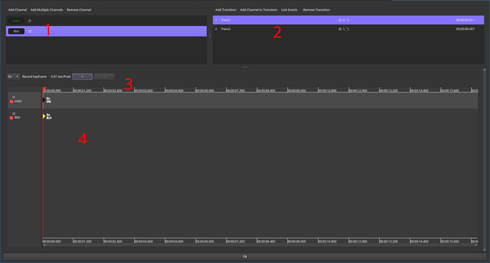
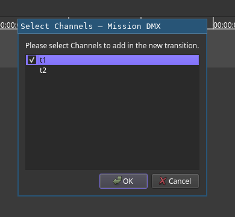
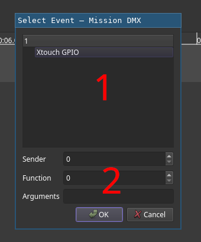
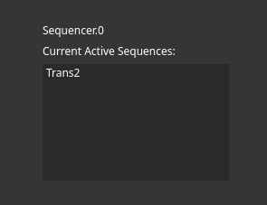

# Sequence Replay Filter

The sequencer filter is a filter that reacts on events and applies selected transitions on its output channels if these events occur.
General ussage is quite simmilar to the [Cue Editor](Cues.md) but transitions may run in parallel and may only affect a subset of available channels.

## Configuration

The editor consist out of four section:

1. The channel editor. The list displays all configured channels and the buttons can be used to manage them.
2. The transition list. It displays their ID, descriptive name, linked trigger event and duration.
3. Timeline Controls. They work just like the Cue Editor and provide transfer function selection, a record button and zoom controls.
4. The timeline Editor. Unlike its counterpart from the Cue editor, it will only display channels present in the current selected transition.

If no transition is active, each channel can have its default value to which it may return.
Otherwise the last active value remains.

### Managing channels

Channels are managed using the channel editor (1).
They may be added using the `Add Channel` or `Add Multiple Channels` buttons.
Selected channels might be removed using the `Remove Channel` button.

### Managing transitions

Adding of a transition is done using the `Add Transition` button.
It is advisable to have all desired target channels added beforehand.

Clicking the button will open uo a dialog requesting the selection of the channels to be added.
Click the check boxes in order to select them.
If channels should be added to the selected transition after creation, the `Add Channel to Transition` button can be used to do so.

Linking events is done using the `Link Event` button.
This will open up a dialog promting for event data:

The list view (1) displays all currently available event senders.
Selecting one will automatically fill in the selector data (2).
It might be advisable to log and rename events prior to event assignment as it's easier for humans to rememeber `snaredrum` instead of `2:15:FF`.

Finally, selected transitions can be removed using the `Remove Transition` button.

### Recording

Recording of transitions works much like the the Cue editor.
Keep in mind that live preview recording mode will only disable fader columns not in use by the active transition but will not remove them.
As a result, you may need to switch pages in order to find the selected columns.

## Sequence Listing in Show UI

For show debugging purposes, a UI widget called `Sequence Listing` exists.
At any given time, it displays all currently active transitions.

