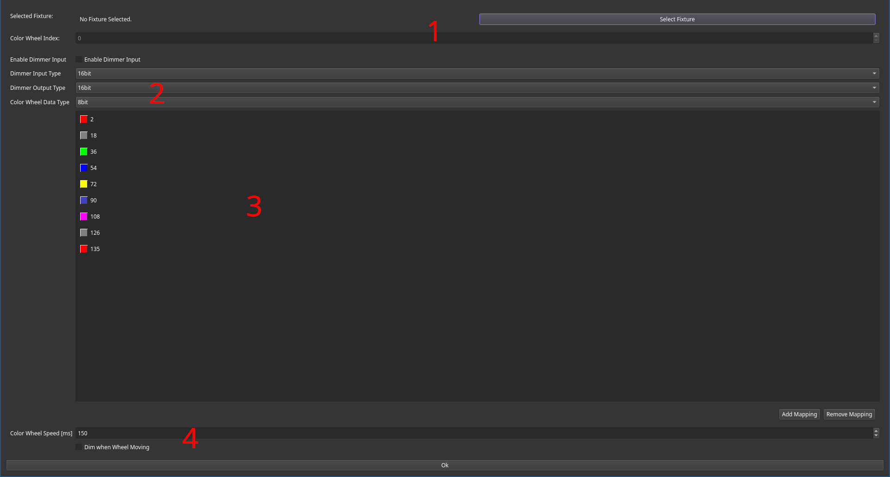

# Color to Colorwheel Adapter

This filter allows automatic mapping of an input color to color wheel control values.
The configuration works as follows:

 1. Selecting a fixture (the dialog requires checking exactly one fixture) loads the color mappings of it.
 2. Data types of control channels can be selected. If a channel is not required, selecting the empty data type will disable it.
 3. Using the mapping view, mappings can be manually corrected by removing or adding entries.
 4. Selecting the color wheel speed together with the "Dim when moving" option will cause the dimmer output to be zero while the color wheel is moving between slots.

## Ports
The `input` and `colorwheel` channels are always available.
`input` is always a color and the data type of `colorwheel` (output) can be changed between 8 and 16 bit.

Based on the configuration of the filter, the ports `in_dimmer` and `dimmer` (output) are also available with their configured data type.
