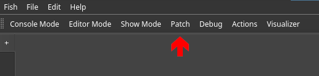
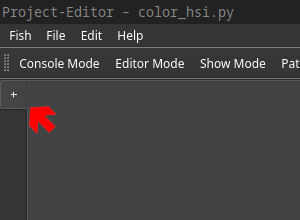
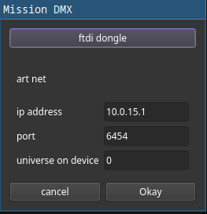
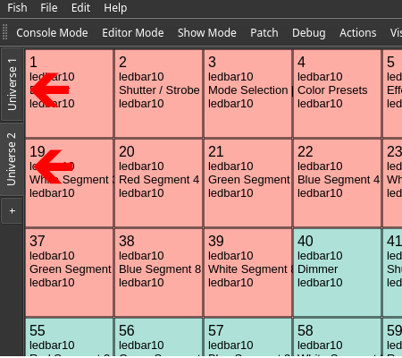
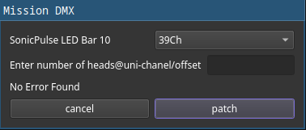

# Pathing view

This document explains how to add universes and fixtures. All patching takes place in the patching view. It can be opened by clicking on the *Patch* button in the GUI or by clicking the patching button on the XTouch.

## Creating Universes
<!--TODO Explain the universe creation dialog together with its options and DMX topologies, as well as hardware aided input methods.-->
A DMX universe holds 512 channels. Unlike commercial solutions, there is no limit how many universes you may add but during our testing, we noticed that it is hard to reasonably add more than 750 universes as your computer will run out of processing power to feed them all.

Adding a universe is done by clicking the plus button at the right hand side of the view.

Doing opens up a dialog prompting you for details about the new universe. Here you have to decide about the connection method of the new universe as well as the details required with that method.

The top button is used to switch between the different methods. The text of the button indicates the *next* method. Some details, such as a specific universe on a device that was used before, will be incremented automatically. Finally you may click *Okay* to add the universe.

## Selecting a Universe to edit
After adding multiple universes, Switching between them can be done using the ID buttons above the add button as shown in the image below.

## Pathing Fixtures into a Universe
<!--
TODO Explain the fixture selector and pathing dialog, as well as their hardware aided methods
-->

Finally, fixtures can be patched to a universe by clicking one of the patching buttons again.
A view presenting fixtures within their manufacturer folders opens up. Once you selected a fixture, you still need to specify your intended mode of operation. Next you need to specify the quantity and locations of your fixture.

A hint regarding the input format is shown next to the corresponding text box. The dialog requires you to specify at least the number and universe. The default start channel is 1. The default offset between two fixtures is the number of channels of the fixture in their current mode.

The software will automatically check for collisions and won't allow you to patch invalid fixture layouts.

## Creating curstom fixtures
TODO explain the online editor and fixture library
