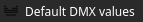
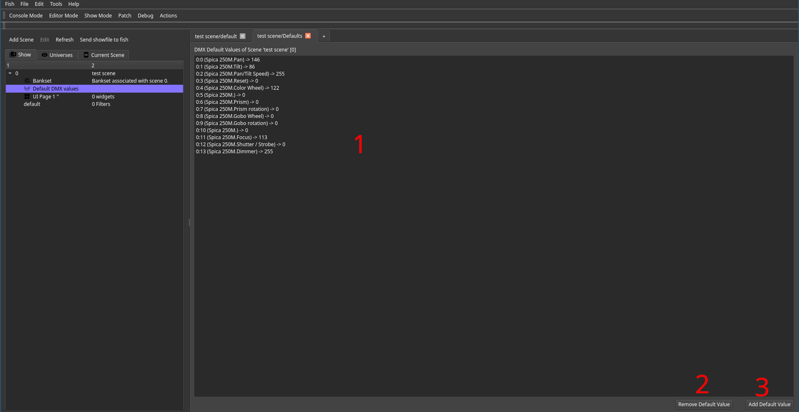
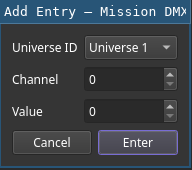
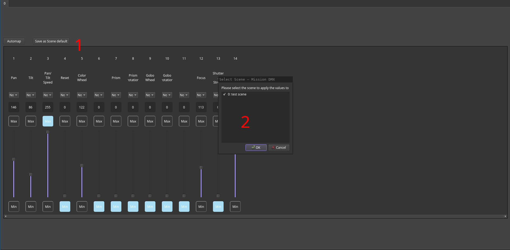

# Default DMX values

A scene can have DMX default values.
These values are applied to the output universes upon activation of the scene.
They remain active as long as they're not overriden by any filter within that scene.

The typical use case for default values is reducing the amount of filters one needs to set up in order to achieve intended scene behavior.
As a result the light technican can save time while building a show file and the computational load is also slightly reduced.
As a rule of thumb, any value that does not need to change during the execution of the scene should be a default value.

Popular examples include a black scene or a scene that only provides static lighting with minimal animation.

Please note, that each universe / channel tuple can only have one default value.
Setting the same channel again will result in the old value being overriden by the new one.

## Default Value Editor

Inside the show browser, each scene has a default value editor, reachable by clicking the following entry:

Inside the editor tab, a list view (1) displays all set channel values.
Entries are listed in the format `universe:channel (fixture) -> value`.

Using the delete button (2) one can remove selected default values.

Using the add button (3) one can insert new defaults using the following dialog:

## Using Console View to Generate Defaults

Inside the console view, one can can save the current configuration as scene defaults.
Once all required settings are dialed in, all one has to do is to press the save button (1) and selecting the desired scenes (2).

Please keep in mind that scenes should be created first.
They can be empty but should exist in order to be selectable.
Also keep in mind that this action will save *all* channels of all universes to the selected scenes.
In order to aviod overwriting existing values, one should use this technique before performing any other changes.

Finally, channels that are not desired can simply be selected and deleted.
As this is a fast procedure in general, it is preferrable to manually selecting channels whose values to save, which can also be done using the context menu of a channel.
