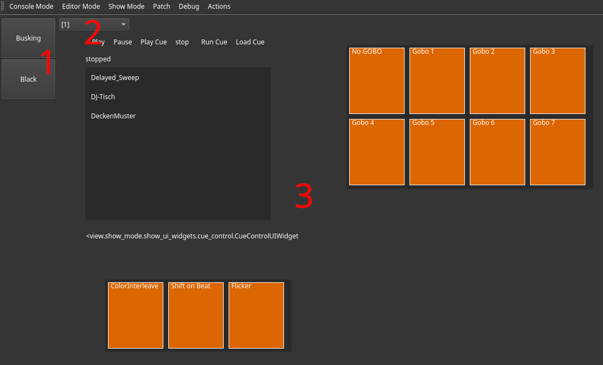

---
---
# Using the Show Controls

The show UI view displays any active show UI. They can be built using the [editor](EditorView.md#ui-editor).
On the left hand side, there is a button group allowing switching between scenes (1).
Each button displays the scene name it switches to.
The button of the current active scene (if any) has a green background color.

Next to the scene switching buttons, a combo box (2) is displayed, allowing selection of the show UI page displayed in this view.
If multiple monitors are detected, available UI pages will be distributed automatically between them.

The reamaining screen space (3) is filled with the content of the show UI page.
