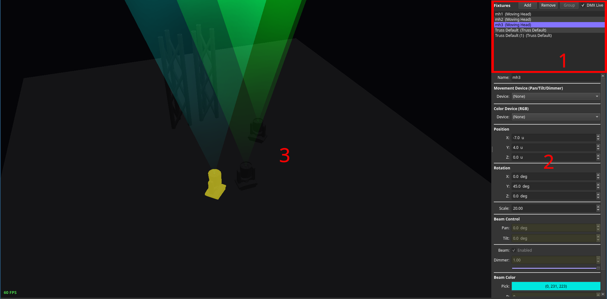
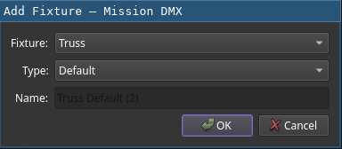

# Using the Visualizer

The visualizer aids in pre-production and preparation of effects during live shows.
It is accessible using the `Visualizer` tab or by pressing the `Visualizer` button on a connected console.

In order to use it, a loaded stage file is required.
Stage files can be loaded using the `Load Stagefile` entry from the `File` menu.
As an alternative, show files can be set up to load associated stage files automatically using the `General` tab from the settings menu.

Live update mode can be enabled or disabled using the `DMX Live` check box.
Once enabled the current DMX output of fish is parsed and applied to all stage objects.

## Setup of Stage files
In order to set up a stage file, one has to use the stage object control (area marked as 1).
They can be added, removed or grouped using the corresponding buttons.

While adding stage objects, the dialog queries for their type, variant (for example, trusses come in many different forms and sizes) and name.
Linking fixtures is possible as well.
Alternatively, a stage file may be shipped without linked fixtures and the task can be done using the property control pane afterwards.

Grouping of stage objects provides the benefit of applying settings to all members at once.
Selected objects are highlightes in yellow within the view display (3).

## Property Control Pane

Using the control pane, the current state of a selected object can be observed.
If a certain property is not locked to a DMX output, it can be manipulated as well.
If a control device for a certain property is selected and locked, the changes from the DMX output will update the property automatically.
The displayed content of the control pane varies from stage object to stage object based on the provided capabilities.
Clicking a stage object in the viewer selects it as well.

## Navigation
Within the viewer (3), the campera position can be manipulated using the left mouse button plus cursor movement (rotation), the mouse wheel (zoom) and `W`, `A`, `S`, `D` keys for position.
Using the right mouse button while tragging manipulates the translation as well.
Press and holding the `F` key labels all stage objects in the viewer.
