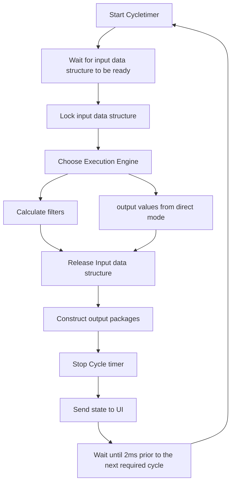

# Fish real time update cycle

## Components
Fish constists out of the following components:
 * I/O update module: Runs a libev event loop for network / ArtNet traffic as well as IPC and FPGA communication
 * Cycle module that loads the correct execution engine (direct or filter), executes it and triggeres the output of new packages
 * On demand module that loads filter sets from a given project file

## Update cycle

