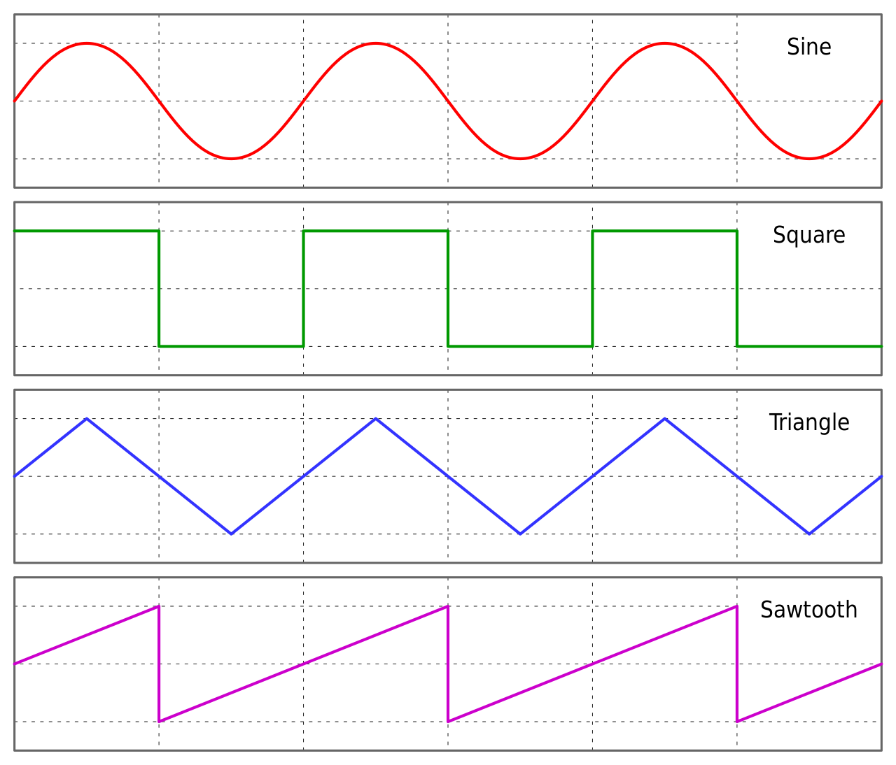

# filter types
The following file specifies the type identifiers as well as the channel names of the filters.

## Constants
These filters provide constant inputs and their values can be updated from the GUI.
### 8 bit constant
- Type name: `constants:8bit`
- Type id: `0`
- Input channels: None
- Output channels:
  * `value`: the stored 8 bit value
- Configuration parameters: None
- initial parameters:
  * `value`: the content of the storage to be set (needs to be parsable as an int)
- GUI update keys:
  * `value`: the content of the storage to be set (needs to be parsable as an int)

### 16 bit constant
- Type name: `constants:16bit`
- Type id: `1`
- Input channels: None
- Output channels:
  * `value`: the stored 16 bit value
- Configuration parameters: None
- initial parameters:
  * `value`: the content of the storage to be set (needs to be parsable as an int)
- GUI update keys:
  * `value`: the content of the storage to be set (needs to be parsable as an int)

### float constant
- Type name: `constants:float`
- Type id: `2`
- Input channels: None
- Output channels:
  * `value`: the stored double value
- Configuration parameters: None
- initial parameters:
  * `value`: the content of the storage to be set (needs to be parsable as a double)
- GUI update keys:
  * `value`: the content of the storage to be set (needs to be parsable as a double)

### color constant
- Type name: `constants:pixel`
- Type id: `3`
- Input channels: None
- Output channels:
  * `value`: the stored color value
- Configuration parameters: None
- initial parameters:
  * `value`: the content of the storage to be set (needs to be in the color format specified below)
- GUI update keys:
  * `value`: the content of the storage to be set (needs to be in the color format specified below)
#### color format
The following format can be parsed: `<hue as a double>,<saturation as a double>,<iluminance as a double>`.
For example: `180.0,1.0,1.0` is a cyan like color.

## Debug Filters
These filters print out the received values on the command line. Later they're supposed to
post them to the debug table of the GUI.
### 8 bit output
- Type name: `dbg:8bit`
- Type id: `4`
- Input channels: `value` of type `8bit`
- Output channels: None
- Configuration parameters: None (Later: method to be used for gui communication)
- initial parameters: None
- GUI update keys: None

### 16 bit output
- Type name: `dbg:16bit`
- Type id: `5`
- Input channels: `value` of type `16bit`
- Output channels: None
- Configuration parameters: None (Later: method to be used for gui communication)
- initial parameters: None
- GUI update keys: None

### float output
- Type name: `dbg:float`
- Type id: `6`
- Input channels: `value` of type `double`
- Output channels: None
- Configuration parameters: None (Later: method to be used for gui communication)
- initial parameters: None
- GUI update keys: None

### color output
- Type name: `dbg:pixel`
- Type id: `7`
- Input channels: `value` of type `hsv_pixel`
- Output channels: None
- Configuration parameters: None (Later: method to be used for gui communication)
- initial parameters: None
- GUI update keys: None

## Adapters and Arithmetics
### Split 16 bit unsigned ints to two 8 bit unsigned ints
- Type name: `adapter:16bit_to_dual_byte`
- Type id: `8`
- Input channels: `value` of type `16bit`
- Output channels:
  * `value_lower`: The lower part of the original variable
  * `value_upper`: The upper part of the original variable
- Configuration parameters: None
- initial parameters: None
- GUI update keys: None

### Convert 16 bit to ngn
- Type name: `adapter:16bit_to_bool`
- Type id: `9`
- Input channels: `value` of type `16bit`
- Output channels: `value` (0 if input was 0, 1 if input was greater than zero)
- Configuration parameters: None
- initial parameters: None
- GUI update keys: None

### MAC filter
- Type name: `arith:mac`
- Type id: `10`
- Input channels:
  * `factor1`: double
  * `factor2`: double
  * `summand`: double
- Output channels: `value` (:= `(factor1 * factor2) + summand`)
- Configuration parameters: None
- initial parameters: None
- GUI update keys: None

### Universe Output
Note: While technically possible, it is advised to use one output filter per universe, as each filter looks up its universe on every cycle and this operation, while being quite fast, cannot be performed in constant time and will, most likely, introduce cache misses.
- Type name: `output`
- Type id: `11`
- Input channels:
  * for each configured universe channel an 8bit one of same name
- Output channels: None
- Configuration parameters:
  * `universe`: The id of the universe to output to
  * every other supplied parameter will be parsed in the format `<universe channel>`:`<filter input channel id>` and registered with the output module, where `<universe channel>` is the key and `<filter input channel id>` the value of the parameter. Every supplied input channel id needs to pe avaiable as an 8 bit input channel within the filter mapping.
- initial parameters: None
- GUI update keys: None

### float to 16bit
- Type name: `arith:round_to_16bit`
- Type id: `12`
- Input channels: `value` of type `double`
- Output channels: `value` of type `16bit` (= rounded and then cut value of input channel)
- Configuration parameters: None
- initial parameters: None
- GUI update keys: None

### float to 8bit
- Type name: `arith:round_to_8bit`
- Type id: `13`
- Input channels: `value` of type `double`
- Output channels: `value` of type `8bit` (= rounded and then cut value of input channel)
- Configuration parameters: None
- initial parameters: None
- GUI update keys: None

### round float
- Type name: `arith:round`
- Type id: `14`
- Input channels: `value` of type `double`
- Output channels: `value` of type `double` (= rounded value of input channel)
- Configuration parameters: None
- initial parameters: None
- GUI update keys: None

### color to RGB
- Type name: `hsi_to_rgb`
- Type id: `15`
- Input channels: `value` of type `color`
- Output channels:
  * `r` of type `8bit`
  * `g` of type `8bit`
  * `b` of type `8bit`
- Configuration parameters: None
- initial parameters: None
- GUI update keys: None

### color to RGBW
- Type name: `hsi_to_rgbw`
- Type id: `16`
- Input channels: `value` of type `color`
- Output channels:
  * `r` of type `8bit`
  * `g` of type `8bit`
  * `b` of type `8bit`
  * `w` of type `8bit`
- Configuration parameters: None
- initial parameters: None

### color to RGBWA
- Type name: `hsi_to_rgbw`
- Type id: `17`
- Input channels: `value` of type `color`
- Output channels:
  * `r` of type `8bit`
  * `g` of type `8bit`
  * `b` of type `8bit`
  * `w` of type `8bit`
  * `a` of type `8bit`
- Configuration parameters: None
- initial parameters: None
- GUI update keys: None

### float to color
- Type name: `float_to_pixel`
- Type id: `18`
- Input channels:
  * `h` of type `double`
  * `s` of type `double`
  * `i` of type `double`
- Output channels:
  * `value` of type `color`
- Configuration parameters: None
- initial parameters: None
- GUI update keys: None

### sine
- Type name: `sine`
- Type id: `19`
- Input channels: 
  * `value` of type `double`
  * `factor_outer` of type `double` (default `1`)
  * `factor_inner` of type `double` (default `1`)
  * `phase` of type `double` (default `0`)
  * `offset` of type `double` (default `0`)
- Output channels: `value` of type `double`
  * = `factor_outer*(sin((value+phase)*factor_inner)) + offset`
- Configuration parameters: None
- initial parameters: None
- GUI update keys: None
- Notes
  * defaults were taken by fish, if these values are not set
  * is calculated as degree

### cosine
- Type name: `cosine`
- Type id: `20`
- Input channels: 
  * `value` of type `double`
  * `factor_outer` of type `double` (default `1`)
  * `factor_inner` of type `double` (default `1`)
  * `phase` of type `double` (default `0`)
  * `offset` of type `double` (default `0`)
- Output channels: `value` of type `double`
  * = `factor_outer*(cos((value+phase)*factor_inner)) + offset`
- Configuration parameters: None
- initial parameters: None
- GUI update keys: None
- Notes
  * defaults were taken by fish, if these values are not set
  * is calculated as degree

### tangent
- Type name: `tangent`
- Type id: `21`
- Input channels: 
  * `value` of type `double`
  * `factor_outer` of type `double` (default `1`)
  * `factor_inner` of type `double` (default `1`)
  * `phase` of type `double` (default `0`)
  * `offset` of type `double` (default `0`)
- Output channels: `value` of type `double`
  * = `factor_outer*(tan((value+phase)*factor_inner)) + offset`
- Configuration parameters: None
- initial parameters: None
- GUI update keys: None
- Notes
  * defaults were taken by fish, if these values are not set
  * is calculated as degree

### arcsine
- Type name: `arcsine`
- Type id: `22`
- Input channels: 
  * `value` of type `double`
- Output channels: `value` of type `double`
  * = `arcsin(value)`
- Configuration parameters: None
- initial parameters: None
- GUI update keys: None
- Notes
  * is calculated as degree

### arccosine
- Type name: `arccosine`
- Type id: `23`
- Input channels: 
  * `value` of type `double`
- Output channels: `value` of type `double`
  * = `arccos(value)`
- Configuration parameters: None
- initial parameters: None
- GUI update keys: None
- Notes
  * is calculated as degree

### arctangent
- Type name: `arctangent`
- Type id: `24`
- Input channels: 
  * `value` of type `double`
- Output channels: `value` of type `double`
  * = `arctan(value)`
- Configuration parameters: None
- initial parameters: None
- GUI update keys: None
- Notes
  * is calculated as degree

### square
- Type name: `square_wave`
- Type id: `25`
- Input channels: 
  * `value` of type `double`
  * `factor_outer` of type `double` (default `1`)
  * `factor_inner` of type `double` (default `1`)
  * `phase` of type `double` (default `0`)
  * `offset` of type `double` (default `0`)
  * `length` of type `double` (default `180`)
- Output channels: `value` of type `double`
- Configuration parameters: None
- initial parameters: None
- GUI update keys: None
- Notes
  * defaults were taken by fish, if these values are not set
  * the period is `360°`
  * the length defines the part (in degrees) where the square is `1` the rest of the period is `-1`

I took this picture as reference, so the waves are also defined like the sine with `360°` and an output between `-1` and `1`.

### triangle
- Type name: `triangle_wave`
- Type id: `26`
- Input channels: 
  * `value` of type `double`
  * `factor_outer` of type `double` (default `1`)
  * `factor_inner` of type `double` (default `1`)
  * `phase` of type `double` (default `0`)
  * `offset` of type `double` (default `0`)
- Output channels: `value` of type `double`
- Configuration parameters: None
- initial parameters: None
- GUI update keys: None
- Notes
  * defaults were taken by fish, if these values are not set
  * the period is `360°`

### sawtooth
- Type name: `sawtooth_wave`
- Type id: `27`
- Input channels: 
  * `value` of type `double`
  * `factor_outer` of type `double` (default `1`)
  * `factor_inner` of type `double` (default `1`)
  * `phase` of type `double` (default `0`)
  * `offset` of type `double` (default `0`)
- Output channels: `value` of type `double`
- Configuration parameters: None
- initial parameters: None
- GUI update keys: None
- Notes
  * defaults were taken by fish, if these values are not set
  * the period is `360°`

### logarithm
- Type name: `logarithm`
- Type id: `28`
- Input channels: 
  * `value` of type `double`
- Output channels: `value` of type `double`
  * = `ln(value)`
- Configuration parameters: None
- initial parameters: None
- GUI update keys: None

### exponential
- Type name: `exponential`
- Type id: `29`
- Input channels: 
  * `value` of type `double`
- Output channels: `value` of type `double`
  * = `e(value)`
- Configuration parameters: None
- initial parameters: None
- GUI update keys: None

### minimum
- Type name: `minimum`
- Type id: `30`
- Input channels: 
  * `param1` of type `double`
  * `param2` of type `double`
- Output channels: `value` of type `double`
  * = `min(param1, param2)`
- Configuration parameters: None
- initial parameters: None
- GUI update keys: None

### maximum
- Type name: `maximum`
- Type id: `31`
- Input channels: 
  * `param1` of type `double`
  * `param2` of type `double`
- Output channels: `value` of type `double`
  * = `max(param1, param2)`
- Configuration parameters: None
- initial parameters: None
- GUI update keys: None

### time
- Type name: `time`
- Type id: `32`
- Input channels: None
- Output channels: `value` of type `double`
- Configuration parameters: None
- initial parameters: None
- GUI update keys: None
- Notes
  * time is the number of millisecons since start of the program

### switch_on_delay_8bit
- Type name: `switch_on_delay_8bit`
- Type id: `33`
- Input channels: 
  * `value` of type of type `8bit`
  * `time` of type of type `double`
- Output channels: `value` of type of type `8bit`
- Configuration parameters: 
  * `delay` should be parseable as `double`
- initial parameters: None
- GUI update keys: None

### switch_on_delay_16bit
- Type name: `switch_on_delay_16bit`
- Type id: `34`
- Input channels: 
  * `value` of type of type `16bit`
  * `time` of type of type `double`
- Output channels: `value` of type of type `16bit`
- Configuration parameters: 
  * `delay` should be parseable as `double`
- initial parameters: None
- GUI update keys: None

### switch_on_delay_double
- Type name: `switch_on_delay_double`
- Type id: `35`
- Input channels: 
  * `value` of type `double`
  * `time` of type of type `double`
- Output channels: `value` of type `double`
- Configuration parameters: 
  * `delay` should be parseable as `double`
- initial parameters: None
- GUI update keys: None

### switch_off_delay_8bit
- Type name: `switch_off_delay_8bit`
- Type id: `36`
- Input channels: 
  * `value` of type of type `8bit`
  * `time` of type of type `double`
- Output channels: `value` of type of type `8bit`
- Configuration parameters: 
  * `delay` should be parseable as `double`
- initial parameters: None
- GUI update keys: None

### switch_off_delay_16bit
- Type name: `switch_off_delay_16bit`
- Type id: `37`
- Input channels: 
  * `value` of type of type `16bit`
  * `time` of type of type `double`
- Output channels: `value` of type of type `16bit`
- Configuration parameters: 
  * `delay` should be parseable as `double`
- initial parameters: None
- GUI update keys: None

### switch_off_delay_double
- Type name: `switch_off_delay_double`
- Type id: `38`
- Input channels: 
  * `value` of type `double`
  * `time` of type of type `double`
- Output channels: `value` of type `double`
- Configuration parameters: 
  * `delay` should be parseable as `double`
- initial parameters: None
- GUI update keys: None
